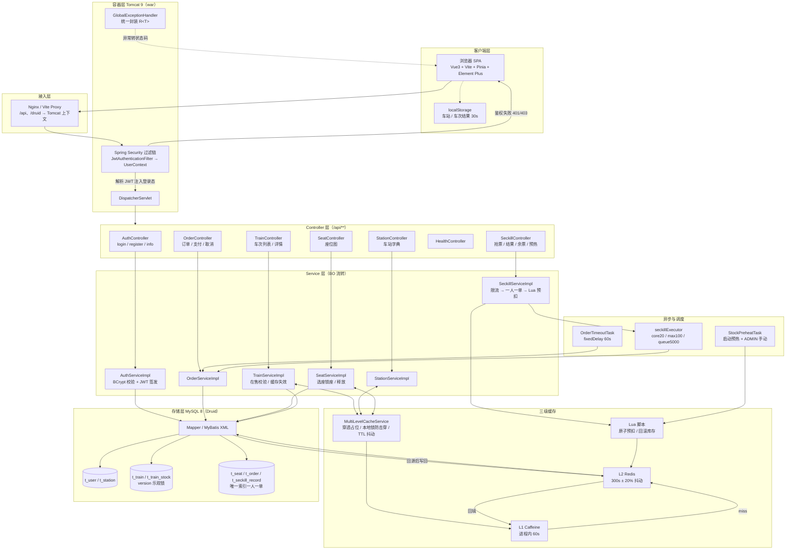
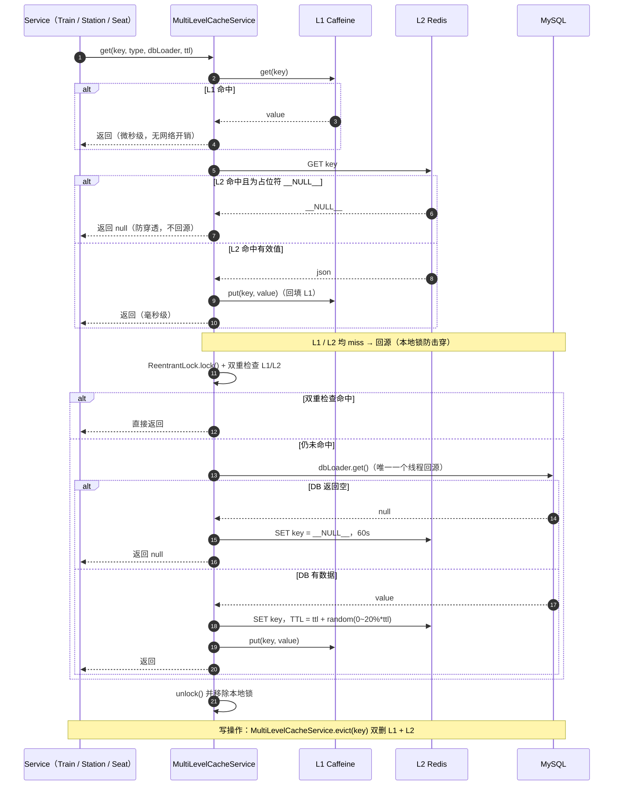
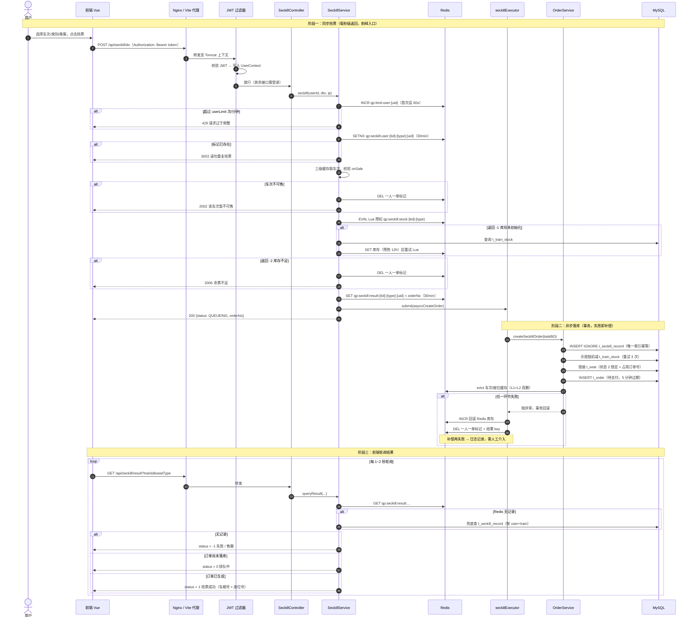

# 火车票秒杀抢票系统

基于 **SSM（Spring + SpringMVC + MyBatis）** 的火车票购票 / 秒杀演示项目，**前后端分离**，分为两个模块：

| 模块 | 说明 | 打包方式 |
| --- | --- | --- |
| `qiangpiao-backend` | 后端 SSM 服务，纯注解配置，**打 war 包部署到 Tomcat** | `war`（`finalName=qiangpiao`，上下文 `/qiangpiao`） |
| `qiangpiao-frontend` | Vue3 + Vite 前端，独立运行 / Nginx 部署 | 静态资源 `dist` |

实现功能：车次查询、余票与座位图、车站字典、**JWT 登录鉴权**、**Redis Lua 原子预扣库存秒杀抢票**、异步下单、**钱包余额支付 / 零钱流水 / 自定义充值**、订单取消、超时关单、**L1/L2/L3 三级缓存**、接口文档（Knife4j）、Druid 监控。

---

## 一、技术栈

### 后端

| 类别 | 选型 | 版本 |
| --- | --- | --- |
| 核心框架 | Spring + SpringMVC + MyBatis | Spring `5.3.34`、MyBatis `3.5.16`、mybatis-spring `2.1.2` |
| 安全 | Spring Security + JWT（jjwt）+ BCrypt | Security `5.8.12`、jjwt `0.11.5` |
| 数据源 | Druid 连接池 + MySQL 8 驱动 | Druid `1.2.22`、mysql-connector-j `8.3.0` |
| 缓存 | Caffeine（L1）+ Redis / Lettuce（L2）+ MySQL（L3） | Caffeine `2.9.3`、spring-data-redis `2.7.18`、Lettuce `6.1.10` |
| 参数校验 | JSR-303 / Hibernate Validator | `6.2.5.Final` |
| 文档 | Knife4j + Springfox | `2.0.9` / `2.9.2` |
| 工具 | Lombok、Logback、Jackson、Commons-Lang3 | `1.18.34` / `1.2.13` / `2.15.4` / `3.12.0` |
| 运行环境 | **Java 8**（`maven.compiler.source/target=8`），Servlet 4.0.1 | 外部 **Tomcat 9.x** |

### 前端

Vue 3 + Vite + Vue Router + Pinia + Element Plus + Axios + dayjs；前端侧用 `localStorage` 做**浏览器级缓存**（车站列表、车次查询结果 30 秒）。

移动端 / 弱网体验：

| 能力 | 实现 |
| --- | --- |
| 移动端适配 | `styles/global.css` 的 `@media (max-width: 768px)`：表单竖排、控件撑满、座位图 4 列、表格压缩并横向滚动、分页居中、弹窗 92vw、按钮加大触控区；顶部导航在窄屏横向滚动（管理员 9 个模块也不挤） |
| 骨架屏 | `components/SkeletonCard.vue`，车次列表 / 车次详情 / 我的订单 / 我的车票 / 钱包 / 退票页在 `loading` 时展示，替代空白页 |
| 错误重试 | `components/ErrorRetry.vue` 页面级「加载失败 + 重新加载」按钮；`utils/request.js` 对**幂等 GET** 自动重试 2 次（400ms/800ms 退避），仅在网络中断 / 超时 / 5xx 时触发，**POST 下单与支付绝不重试**避免重复下单 |

### 为什么必须用 Tomcat 9.x

项目使用 `javax.servlet-api 4.0.1`，而 **Tomcat 10+ 已切换为 `jakarta.*` 命名空间**，使用 10.x 会直接 `ClassNotFoundException` / `NoSuchMethodError`。请务必下载 Tomcat **9.0.x**。

---

## 二、目录结构

```
qiangpiao
├─ pom.xml                       # 父工程（pom）：统一依赖版本管理
├─ README.md
├─ 技术.md                        # 技术选型说明
├─ qiangpiao-backend/
│  ├─ pom.xml                    # packaging=war，finalName=qiangpiao
│  └─ src/main/
│     ├─ java/com/qiangpiao/
│     │  ├─ config/              # RootConfig(根容器) / WebMvcConfig(MVC子容器) / DataSourceConfig(Druid)
│     │  │                       # MybatisConfig / RedisConfig(Lua脚本) / CacheConfig / SecurityConfig / AsyncConfig / SwaggerConfig
│     │  ├─ controller/          # 7 个 REST Controller，全部 /api/** 前缀
│     │  ├─ service/ + service/impl/   # 业务层，Service 之间传递 BO
│     │  ├─ mapper/              # MyBatis 接口（SQL 在 resources/mapper/*.xml）
│     │  ├─ dataobject/          # DO 数据库实体（注意包名是 dataobject）
│     │  ├─ dto/                 # 入参 DTO，带 JSR-303 注解
│     │  ├─ bo/                  # Service 层业务对象
│     │  ├─ vo/                  # 出参 VO，屏蔽敏感字段
│     │  ├─ cache/               # LocalCache(L1 Caffeine) / MultiLevelCacheService(三级缓存门面)
│     │  ├─ security/            # JwtAuthenticationFilter / LoginUser
│     │  ├─ task/                # StockPreheatTask(库存预热) / OrderTimeoutTask(超时关单)
│     │  └─ common/              # result(R, ResultCode, PageResult) / exception(BizException, GlobalExceptionHandler)
│     │                          # constant(Constants, RedisKeys) / context(UserContext) / util / validate
│     ├─ resources/
│     │  ├─ config.properties    # 唯一外部化配置源（DB / Redis / 缓存 / JWT / 秒杀）
│     │  ├─ logback.xml
│     │  ├─ mapper/*.xml         # 7 个 MyBatis 映射文件
│     │  └─ sql/schema.sql、sql/data.sql
│     └─ webapp/WEB-INF/web.xml  # ContextLoaderListener + DispatcherServlet + Security/Druid 过滤器
└─ qiangpiao-frontend/
   ├─ vite.config.js             # dev 代理：/api → http://localhost:8081 + 上下文
   └─ src/
      ├─ api/                    # auth / train / station / order / seckill
      ├─ views/                  # Login、TrainList、TrainDetail、OrderList、Profile
      ├─ router/                 # /trains、/orders、/profile(需登录) 等
      ├─ store/                  # Pinia：user / station
      └─ utils/                  # request.js(axios 封装) / cache.js / dayjs.js
```

### 分层规范

```
Controller  ──接收──▶ DTO ──▶ Service ──流转──▶ BO ──▶ Mapper ──▶ DO ──▶ MySQL
Controller ◀──返回── VO  ◀── Service
```

- **DTO**：Controller 入参，JSR-303 校验（`@Valid` + `ValidationGroups` 分组）
- **BO**：Service 之间传递，承载多表组装结果
- **DO**：与数据表一一对应（`BaseDO` 提供公共字段）
- **VO**：Controller 出参，脱敏（如身份证）后返回给前端

---

## 三、运行环境要求

| 组件 | 要求 |
| --- | --- |
| JDK | 8 及以上（本机实测 JDK 21 可正常编译运行） |
| Maven | 3.6+ |
| MySQL | 8.x（需创建 `qiangpiao` 库） |
| Redis | 5.x+（秒杀库存、缓存、限流均依赖 Redis） |
| Tomcat | **9.0.x**（不能用 10+） |

---

## 四、快速开始

### 1. 初始化数据库

```bash
cd qiangpiao-backend/src/main/resources/sql
mysql -uroot -p -e "CREATE DATABASE IF NOT EXISTS qiangpiao DEFAULT CHARACTER SET utf8mb4;"
mysql -uroot -p qiangpiao < schema.sql
mysql -uroot -p qiangpiao < data.sql
```

`data.sql` 会写入：10 个车站、3 个用户、6 个车次、三档席别库存，并按真实座位数校准库存。

### 1.1 导入全量车站与公开高铁线路车次（可选但推荐）

```bash
cd 项目根目录
node scripts/import-data.js          # 生成 SQL：scripts/sql/*.sql
mysql -uroot -p qiangpiao < scripts/sql/stations_import.sql   # 3396 个车站（12306 station_names）
mysql -uroot -p qiangpiao < scripts/sql/trains_import.sql     # 15 条高铁线路 / 72 个车次模板
mysql -uroot -p qiangpiao < scripts/sql/future_dates_import.sql  # 复制出未来 13 天班次
```

脚本说明：

| 环节 | 数据来源 | 产出 |
| --- | --- | --- |
| 车站 | `md/数据.js`（12306 `station_names` 全量） | `t_station` 3396 个车站（站名 / 城市 / 拼音简码，`INSERT IGNORE` 去重） |
| 线路 | 内置 15 条公开高铁（京沪、京广、沪昆、京哈、徐兰、成渝、广深港、杭深、京津、沪宁、京张、合福、宁杭、济青、西成） | `t_line` + `t_line_station` 线路与途经站 |
| 车次 | 每条线路按真实号段生成上下行与区段车次（G1/G2…、D3101、C2001） | `t_train` 模板 + `t_train_stock` 三档席别 + `t_seat` 800 座/车次 + `t_carriage` 8 节车厢 + `t_train_stop` 途经站时刻 |
| 未来班次 | 以模板复制 | 未来 13 天班次（库存、座位同步复制） |

- 脚本只生成 SQL，不连数据库；全部语句幂等（`INSERT IGNORE` / `NOT EXISTS`），可重复执行。
- 只需插入「今天」的模板班次，`TrainScheduleTask` 会以最早一天为模板自动补齐到 30 天（启动 10s 执行一次，之后每小时一次）。
- 修改线路/车次：编辑 `scripts/import-data.js` 中的 `LINES` 配置后重新生成即可。

### 2. 修改后端配置

编辑 `qiangpiao-backend/src/main/resources/config.properties`：

```properties
jdbc.url=jdbc:mysql://127.0.0.1:3306/qiangpiao?...
jdbc.username=root
jdbc.password=你的MySQL密码

redis.host=127.0.0.1
redis.port=6379
redis.password=
```

> **不想把密码写进 war？** 数据源支持外部化覆盖，优先级：**环境变量 > JVM 参数 > config.properties**
>
> - 环境变量：`QP_DB_URL` / `QP_DB_USERNAME` / `QP_DB_PASSWORD`
> - Tomcat 启动参数：在 `bin/setenv.bat` 中写 `set JAVA_OPTS=-Djdbc.password=xxx`
> - IDEA：Run/Debug Configurations → Tomcat → VM options 加 `-Djdbc.password=xxx`

### 3. 打包 war

在项目根目录执行：

```bash
mvn -B -pl qiangpiao-backend -am clean package -DskipTests
```

产物：`qiangpiao-backend/target/qiangpiao.war`（约 45 MB）

### 4. 部署到 Tomcat 9

```bash
# war 名为 qiangpiao.war → 上下文路径为 /qiangpiao
copy qiangpiao-backend\target\qiangpiao.war D:\software\tomcat\apache-tomcat-9.0.x\webapps\

cd D:\software\tomcat\apache-tomcat-9.0.x\bin
startup.bat
```

- 若想以根路径访问（`/api/trains` 而非 `/qiangpiao/api/trains`），把 war 改名为 `ROOT.war`（先删除 `webapps/ROOT` 目录）。
- 建议修改 `conf/server.xml` 的 Connector，避免中文 GET 参数乱码：

  ```xml
  <Connector port="8081" protocol="HTTP/1.1"
             connectionTimeout="20000" redirectPort="8443"
             URIEncoding="UTF-8" />
  ```

- 也可以直接用 Tomcat Manager（`http://localhost:8081/manager/html`）上传 war 热部署。

### 5. 启动前端

```bash
cd qiangpiao-frontend
npm install
npm run dev          # http://localhost:5174
```

生产发布：

```bash
npm run build        # 产物 dist/
```

Nginx 参考配置：

```nginx
server {
    listen 80;
    root D:/daima/Lianshi/qiangpiao/qiangpiao-frontend/dist;
    index index.html;
    location / { try_files $uri $uri/ /index.html; }
    location /api/   { proxy_pass http://127.0.0.1:8081/qiangpiao/api/; }
    location /druid/ { proxy_pass http://127.0.0.1:8081/qiangpiao/druid/; }
}
```

> ⚠️ **上下文路径必须与前端代理一致**
> 前端 dev 代理见 `qiangpiao-frontend/vite.config.js`：
> ```js
> const BACKEND_ORIGIN  = process.env.VITE_BACKEND_ORIGIN  || 'http://localhost:8081'
> const BACKEND_CONTEXT = process.env.VITE_BACKEND_CONTEXT || '/qiangpiao'
> ```
> 若用 IDEA 部署（默认上下文可能是 `/qiangpiao_backend_war`），需同步改成相同值，否则接口会 404：
> ```bash
> set VITE_BACKEND_CONTEXT=/qiangpiao_backend_war && npm run dev
> ```

### 6. 验证清单

| 地址 | 期望 |
| --- | --- |
| `http://localhost:8081/qiangpiao/api/health` | `{"code":200,"data":{"status":"UP",...}}` |
| `http://localhost:8081/qiangpiao/doc.html` | Knife4j 接口文档 |
| `http://localhost:8081/qiangpiao/druid/index.html` | Druid 监控（admin / admin123） |
| `http://localhost:5174/trains` | 车次列表（免登录即可查看） |
| `http://localhost:5174/wallet` | 我的钱包：余额 / 充值 / 零钱流水（需登录） |
| `http://localhost:5174/tickets` | 我的车票：未开车（待出行）/ 历史车票（需登录） |

---

## 五、默认账号

| 账号 | 密码 | 角色 | 说明 |
| --- | --- | --- | --- |
| `admin` | `123456` | ROLE_ADMIN | 重导 `data.sql` 后生效 |
| `zhangsan` / `lisi` | `123456` | ROLE_USER | 同上 |

> 密码使用 **BCrypt** 存储。BCrypt 每次加密带随机盐，`data.sql` 中保存的是一条与 `123456` 匹配的合法密文；如果重新生成，`密文不同但同样能校验通过`。
> 若某些历史库是用旧脚本初始化的，`admin` 的口令可能为 `admin123`，重跑一次 `data.sql` 即会重置为 `123456`（`ON DUPLICATE KEY UPDATE` 已包含 `password = VALUES(password)`）。

> 执行 `data.sql` 后会自动为所有用户**开通钱包并赠送 1000.00 元**初始余额（幂等，同时写入一条「开户赠送」流水）；购票支付即从该余额扣款，余额不足请到「我的钱包」自定义金额充值。

---

## 六、核心设计

### 6.1 系统架构与业务流转全景图

> 线上（如 GitHub）与多数 IDE 内置预览可直接渲染 Mermaid；本地 Markdown 编辑器看不到图时，可粘到 <https://mermaid.live> 查看。



### 6.2 统一返回与全局异常

统一返回体 `R<T>`：

```json
{ "code": 200, "message": "操作成功", "data": {}, "traceId": null, "timestamp": 1790181657341 }
```

`GlobalExceptionHandler`（`@RestControllerAdvice`）统一处理并转成对应状态码：

| 异常 | 处理 |
| --- | --- |
| `BizException` | 返回业务 code + message |
| `MethodArgumentNotValidException` / `BindException` / `ConstraintViolationException` | 400 + 字段校验提示拼接 |
| `MissingServletRequestParameterException` / `MethodArgumentTypeMismatchException` / `HttpMessageNotReadableException` | 400 + 参数错误提示 |
| `HttpRequestMethodNotSupportedException` | 405 |
| `AuthenticationException` / `AccessDeniedException` | 401 / 403 |
| `Exception`（兜底） | 500 + 记录堆栈 |

`ResultCode` 分段：通用 `200/400/401/403/404/405/429/500/503`，用户 `1001~1005`，车次座位 `2001~2007`，秒杀 `3001~3005`，订单 `4001~4004`。

### 6.3 三级缓存

```
请求 → L1 Caffeine(JVM 本地, 60s) → L2 Redis(默认 300s + 抖动) → L3 MySQL → 回写 L2、L1
```

- **防穿透**：DB 空结果写入占位符 `__NULL__`（60s），命中占位直接返回 null，不回源
- **防击穿**：per-key `ReentrantLock` + 双重检查，回源后回填
- **防雪崩**：TTL 随机抖动 `ttl + random(0~20%*ttl)`，L1 采用更短的 60s
- **一致性**：写操作后 `evict()` 双删 L1 + L2

主要缓存 key：

| key | 格式 | TTL |
| --- | --- | --- |
| 车次列表 | `qp:cache:train:list:{from}-{to}-{date}:{pageNum}:{pageSize}` | 300s |
| 车次详情 | `qp:cache:train:detail:{trainId}` | 300s |
| 车站全量 | `qp:cache:station:all` | 300s |
| 座位图 | `qp:cache:seat:map:{trainId}:{seatType}` | 120s |
| 秒杀库存 | `qp:seckill:stock:{trainId}:{seatType}` | 预热 12h |
| 限购标记 | `qp:seckill:user:{trainId}:{userId}` | 30min |
| 抢票结果 | `qp:seckill:result:{trainId}:{seatType}:{userId}` | 30min |
| 接口限流 | `qp:limit:user:{userId}` | 60s |

> 说明：回源锁是 **JVM 本地锁**（`ConcurrentHashMap` + `ReentrantLock`），并非分布式锁，多实例部署时不同节点仍可能并发回源；`RedisKeys.lock()` / 解锁 Lua 已预留但当前业务未使用。

读取时序图（对应 6.3 三级缓存）：



### 6.4 秒杀抢票流程

1. **限流**：`INCR qp:limit:user:{userId}`，超过 `seckill.user-limit`（默认 20 次/分钟）→ `429`
2. **限购标记**：`SETNX qp:seckill:user:{trainId}:{userId}`（30min，**不分席别**），失败 → `3006 每人每天每车次限购 1 张`
   - **DB 兜底**：Redis 标记 30min 过期后同步层就失去限购能力，因此紧接着再查一次
     `t_seckill_record(train_id, seat_type, user_id)`，命中抛 `3003`（取消/退票会删除该记录，故取消后可重买）
3. **车次校验**：三级缓存取车次，判断是否在售；不可售则回滚步骤 2 的标记
3.1 **限购规则（以订单表为准，`PurchaseLimitService`）**：
   - **每人每天每车次限购 1 张**：`t_order` 按 `(train_id, user_id)` 统计有效订单（0 待支付 / 1 已支付），已有则 `3006`；
     `train_id` 本身即「某一天的实际班次」（`uk_train_no_date`），故天然满足「每天每车次」
   - **行程运行时间内不可重复购票**：已购有效订单的运行区间 `[发车时刻, 到达时刻]` 与目标车次区间重叠 → `3007`，
     必须等已购车次到达（下车）后才能再买；跨天到达用 `arrive_time <= depart_time` 判定并 +1 天
   - 异步落库（`createSeckillOrder`）开头再校验一次，作为并发下的最后兜底，失败进补偿流程并把原因回写给前端
4. **Lua 原子预扣库存**：`qp:seckill:stock:{trainId}:{seatType}`

   ```lua
   local stock = redis.call('get', KEYS[1])
   if (stock == false) then return -1 end      -- 未初始化
   if (tonumber(stock) <= 0) then return -2 end -- 库存不足
   return redis.call('decr', KEYS[1])           -- 扣减后剩余
   ```

   返回 `-1` 会自动预热一次再重试
5. **写结果 + 投递异步任务**：生成订单号写入 `qp:seckill:result:...`，立即返回 `QUEUEING`，由 `seckillExecutor` 线程池异步落库（core 20 / max 100 / queue 5000）
6. **异步落库**：`INSERT IGNORE t_seckill_record`（唯一索引保证幂等）→ 乐观锁扣 `t_train_stock`（重试 3 次，防超卖最后防线）→ 乐观锁占座 `t_seat` → 建待支付订单（5 分钟过期）→ 失效缓存；**任一环节失败则补偿回滚**（Redis 库存 `INCR` + 删除一人一单标记 + **把失败原因写回结果 key，格式为 `FAIL:<原因>`**）

前端通过 `GET /api/seckill/result` 轮询结果：`-1` 失败/售罄、`0` 排队中、`1` 成功（返回车厢座位号）。

> ⚠️ **异步线程池里的异常不会走 `GlobalExceptionHandler`**
> `@RestControllerAdvice` 只拦截 DispatcherServlet 线程内的异常。异步落库跑在 `seckillExecutor` 中，
> 异常被 `asyncCreateOrder` 吞掉并执行补偿，因此失败原因必须通过 Redis 结果 key（`FAIL:` 前缀）回传，
> 前端轮询读到 `-1` 时会展示具体原因（如「请勿重复抢票」「余票不足」），而不是一直停在「排队中」。

秒杀抢票完整时序图：



### 6.5 安全与鉴权

- **无状态**：禁用 Session / CSRF / formLogin / httpBasic，JWT 携带
- **Token 头**：`Authorization: Bearer <token>`（也兼容 `?token=` query 参数），有效期默认 7200 秒
- **免登录路径**：

  ```
  /api/auth/**  /api/trains/**  /api/stations/**  /api/health/**
  /doc.html  /swagger-resources/**  /v2/api-docs  /webjars/**  /druid/**  /error/**
  ```

  其余请求（`orders`、`seats`、`seckill`）必须登录；未登录返回 `{"code":401,"message":"未登录或登录已过期"}`，前端会自动清理 token 并跳转 `/login`
- **管理员**：`@PreAuthorize("hasRole('ADMIN')")` 保护库存预热接口

### 6.6 定时任务

- `StockPreheatTask`：启动后预热 / 校准 Redis 秒杀库存
- `OrderTimeoutTask`：扫描超时未支付订单并关闭（归还座位与库存）
- `TrainScheduleTask`：**按日期生成班次**（车次模板 → 每日实际班次），启动 10 秒后 + 每小时执行。
  以「每个车次号最早且已配置库存/座位的记录」为模板，为今天起 `ticket.query-days`（默认 30）天批量复制班次
  （含各席别库存与座位图，余量重置为总量），保证**每天都有车次可查询、可发车、可售卖**
  - 幂等依赖 `uk_train_no_date`：已存在该日期班次则跳过，重复执行无副作用
  - 生成后失效车次列表 / 详情缓存
  - 旧方案 `TrainDateRollTask`（把已发车车次日期整体滚动到明天）已废弃删除：它会让历史订单的车次日期被改写，
    且同一时刻只存在一天的班次，导致「今天查不到票、明天之后也没有票」

### 6.7 售票规则与时间窗

规则集中在 `TrainServiceImpl`，`SeckillServiceImpl` 复用同一套判定（`assertTicketSellable`）：

| 规则 | 配置项 | 位点 | 说明 |
| --- | --- | --- | --- |
| 可查询范围 | `ticket.query-days=30` | `TrainServiceImpl.query` | 日期超出「今天 ~ 今天+29 天」直接抛 `TRAIN_QUERY_DATE_INVALID`；不传日期默认查当天 |
| 只查未发车车次 | — | `TrainMapper` 的 `Not_Departed_Condition` | `depart_date > CURDATE() OR (depart_date = CURDATE() AND depart_time > NOW())`，列表与 count 同条件 |
| 预售期 | `ticket.presale-days=14` | 秒杀校验 | 发车日期超过「今天+14 天」返回 `TICKET_NOT_ON_SALE` |
| 开车前停售 | `ticket.stop-sell-minutes=20` | 秒杀校验 | 距发车不足 20 分钟返回 `TICKET_STOP_SELL` |
| 禁止购买已发车 | — | 秒杀校验 | 发车时刻已过返回 `TRAIN_DEPARTED`；同时释放已占的限购标记，避免用户改期重试被误判为重复抢票 |
| 每人每天每车次限购 1 张 | — | `PurchaseLimitService` | `t_order` 按 `(train_id, user_id)` 统计有效订单（待支付/已支付），已有则 `3006`，不分席别 |
| 行程运行时间内不可再买 | — | `PurchaseLimitService` | 已购有效订单区间 `[发车, 到达]` 与目标区间重叠则 `3007`，需等下车（到达）后才能再买 |
| 购票资格预检 | `GET /api/trains/{trainId}/buy-block` | `TrainServiceImpl.buyBlockReason` | 前端进详情页即提示原因并禁用抢票按钮，避免无意义请求 |

列表出参 `TrainVO` 额外返回 `sellable` 与 `sellTip`（「已发车 / 预售期尚未开始 / 开车前 20 分钟停止售票」），前端据此禁用抢票按钮，不必等到下单才报错。

**订单乘车日期快照**：班次按日期生成后，同一车次号会有很多天的班次记录，如果订单直接读 `t_train.depart_date`，容易与订单当时的乘车日期混淆。因此 `t_order` 增加 `depart_date` 列，下单时把当时的乘车日期写入订单；订单详情、订单列表、我的车票统一以该快照为准（老数据已按 `train_id` 回填）。

**可查询 vs 可购买**：查询范围 `ticket.query-days=30` 天（前端日期选择器同步限制），购买范围 `ticket.presale-days=14` 天。超出预售期的班次在列表里照常展示，但 `sellable=false`、`sellTip="预售期尚未开始"`。

### 6.8 日志（Logback）

配置文件：`qiangpiao-backend/src/main/resources/logback.xml`（可通过 `-Dlogback.configurationFile=...` 覆盖）。

| 输出 | 文件 | 级别 / 说明 |
| --- | --- | --- |
| 控制台 | — | `CONSOLE_LEVEL` 控制，默认 DEBUG；生产加 `-DCONSOLE_LEVEL=INFO` 降级 |
| 全量镜像 | `D:\rizi1\qiangpiao\DEBUG.log` | FileAppender，`append=false` → **每次重启清空重写**，输出 DEBUG 及以上，与控制台同内容 |
| 分类 | `info-yyyy-MM-dd.log` / `warn-yyyy-MM-dd.log` / `error-yyyy-MM-dd.log` | `LevelFilter` 精准隔离，只收对应级别，互不交叉；按天滚动 + 单文件 100MB 再切分（`.0`/`.1`），保留 30 天 |
| 慢 SQL | `D:\rizi1\qiangpiao\SQL\slow-sql-yyyy-MM-dd.log` | MyBatis 拦截器（logger `SLOW_SQL`）+ Druid `StatFilter`，耗时 > `sql.slow-threshold-ms`（默认 100ms） |
| 秒杀 | `seckill-yyyy-MM-dd.log` | 秒杀业务单独一份，便于排查超卖 / 重复下单 |

要点：

- **异步**：所有文件输出经 `AsyncAppender`（队列 4096，`discardingThreshold=0` 不丢 WARN/ERROR），业务线程只写队列；`DelayingShutdownHook` 保证退出前刷盘
- **不重复**：慢 SQL / Druid 慢日志 `additivity=false`；同一个 appender 不会被多个 logger 重复引用
- **根 logger**：`DEBUG`（业务包 `com.qiangpiao` 为 DEBUG，Spring / MyBatis / Druid / Lettuce / logback 自身限制为 WARN，避免 DEBUG 风暴）
- **慢 SQL 拦截**：`SlowSqlInterceptor` 挂在 `SqlSessionFactory` 的 plugins 上，记录耗时并把 `?` 替换为真实参数，格式化失败也不影响业务
- **路径外部化**：`-DQP_LOG_HOME=...`、`-DQP_SQL_LOG_HOME=...`（用 `QP_` 前缀，避免被机器上已存在的 `LOG_HOME` 环境变量覆盖）；`-DMAX_HISTORY`、`-DMAX_FILE_SIZE` 同样可覆盖

---

## 七、接口清单

上下文前缀示例：`http://localhost:8081/qiangpiao`

### 认证 `/api/auth`

| 方法 | 路径 | 说明 | 鉴权 |
| --- | --- | --- | --- |
| POST | `/api/auth/login` | 登录，返回 JWT | 免登录 |
| POST | `/api/auth/register` | 注册，默认 ROLE_USER | 免登录 |
| GET | `/api/auth/info` | 当前登录用户 | 需登录 |

### 车次 `/api/trains`

| 方法 | 路径 | 说明 | 鉴权 |
| --- | --- | --- | --- |
| GET | `/api/trains` | 分页查询（三级缓存） | 免登录 |
| GET | `/api/trains/{trainId}` | 车次详情（含座位图） | 免登录 |

### 车站 `/api/stations`

| 方法 | 路径 | 说明 | 鉴权 |
| --- | --- | --- | --- |
| GET | `/api/stations` | 全部车站 | 免登录 |
| GET | `/api/stations/search?keyword=` | 模糊搜索 | 免登录 |

### 座位 `/api/seats`

| 方法 | 路径 | 说明 | 鉴权 |
| --- | --- | --- | --- |
| GET | `/api/seats/{trainId}/{seatType}` | 座位图（1 商务 / 2 一等 / 3 二等） | 需登录 |

### 秒杀 `/api/seckill`

| 方法 | 路径 | 说明 | 鉴权 |
| --- | --- | --- | --- |
| POST | `/api/seckill/do` | 抢票（异步下单，返回排队中） | 需登录 |
| GET | `/api/seckill/result` | 轮询抢票结果 | 需登录 |
| GET | `/api/seckill/stock` | 实时余票（未预热返回 -1） | 需登录 |
| POST | `/api/seckill/preheat/{trainId}` | 预热指定车次库存 | ADMIN |
| POST | `/api/seckill/preheat` | 全量预热库存 | ADMIN |

### 订单 `/api/orders`

| 方法 | 路径 | 说明 | 鉴权 |
| --- | --- | --- | --- |
| GET | `/api/orders` | 我的订单（分页） | 需登录 |
| GET | `/api/orders/{orderNo}` | 订单详情（身份证脱敏） | 需登录 |
| POST | `/api/orders/pay` | 支付（模拟） | 需登录 |
| POST | `/api/orders/{orderNo}/cancel` | 取消订单（释放座位 + 归还库存） | 需登录 |

### 我的车票 `/api/tickets`

| 方法 | 路径 | 说明 | 鉴权 |
| --- | --- | --- | --- |
| GET | `/api/tickets` | 我的车票（分页）：`type=upcoming` 未开车、`type=history` 历史，支持 `pageNum` / `pageSize` | 需登录 |

分类规则（以车次 `depart_date + depart_time` 是否早于 now 判定是否发车）：

- **未开车**：`status=1 已支付` 且尚未发车，按发车时间升序（最近要坐的排在最前）
- **历史车票**：已发车的票 + `已取消 / 已退票 / 已超时` 的订单，按发车时间倒序
- 待支付订单不属于车票，需先到「我的订单」完成支付

返回字段额外给出 `ticketStatus`（1 待出行 / 2 已出行 / 3 已失效）、`ticketStatusText`、`departed`、`daysFromNow`（距发车天数，前端据此显示「今天发车 / 明天发车 / 还有 N 天发车」）。

### 管理后台 `/api/admin`（需 ROLE_ADMIN）

| 模块 | 接口 |
| --- | --- |
| 车站 | `GET/POST /admin/stations`、`PUT /admin/stations/{id}/status`（停用/启用） |
| 线路 | `GET/POST /admin/lines`、`DELETE /admin/lines/{id}`、`GET/POST /admin/lines/{lineId}/stations`（途经站与顺序） |
| 车次 | `GET /admin/trains`、`PUT /admin/trains/{id}/status`（停开某天班次）、`GET/POST /admin/trains/{id}/stops`（时刻表）、`GET/POST /admin/trains/{id}/carriages`（车厢）、`POST /admin/trains/{id}/schedule?date=`（按日期生成当日班次） |
| 票价 | `PUT /admin/stocks/{id}/price`、`PUT /admin/stocks/{id}/total` |
| 订单 | `GET /admin/orders`（订单号/手机号/状态/日期筛选）、`GET /admin/orders/{orderNo}`、`GET /admin/orders/{orderNo}/logs`、`GET /admin/orders/{orderNo}/changes`、`POST /admin/orders/{orderNo}/refund`（人工退票） |
| 用户 | `GET /admin/users`、`PUT /admin/users/{id}/status`（封禁/解封） |
| 公告 | `GET/POST /admin/announcements`、`DELETE /admin/announcements/{id}`；前台 `GET /api/announcements` 免登录 |
| 监控 | `GET /admin/monitor/stock`（余票）、`GET /admin/monitor/locked-seats`（锁票） |
| 报表 | `GET /admin/stats`、`/daily-sales`、`/train-sales`、`/user-growth`、`GET /admin/stats/export?type=`（导出 CSV，Excel 可直接打开） |

### 退票 / 改签 `/api/after-sale`

| 方法 | 路径 | 说明 |
| --- | --- | --- |
| POST | `/api/after-sale/refund` | 退票：限已支付且未发车，释放座位、归还库存、票款退回钱包 |
| POST | `/api/after-sale/change` | 改签：换到未发车且有余票的车次，差额多退少补 |
| GET | `/api/after-sale/{orderNo}/timeline` | 订单流转时间轴 |
| GET | `/api/after-sale/{orderNo}/changes` | 改签历史 |

**车次模板与每日班次**：`t_train` 每行是「某一天的实际班次」，`POST /admin/trains/{id}/schedule` 以指定班次为模板复制（车型、时刻、库存、座位）生成新日期班次，实现「模板 + 每日排班」分离；`TrainScheduleTask` 每小时自动为今天起 30 天补齐班次，保证每天都有车次可查可买（购买仍受 14 天预售期限制）。

### 钱包 `/api/wallet`

| 方法 | 路径 | 说明 | 鉴权 |
| --- | --- | --- | --- |
| GET | `/api/wallet` | 钱包余额、累计充值 / 累计消费 | 需登录 |
| GET | `/api/wallet/flows` | 零钱流水分页（`pageNum` / `pageSize`） | 需登录 |
| POST | `/api/wallet/recharge` | 自定义金额充值（0.01 ~ 50000，最多 2 位小数） | 需登录 |

> **支付链路**：`POST /api/orders/pay` 会先扣钱包余额再置单为已支付（同一事务）。
> 余额不足返回 `5002`，前端会引导跳转到「我的钱包」充值。
> 每笔充值 / 消费都会写 `t_wallet_flow`：`type`（1 充值 / 2 消费 / 3 退款）、`title`（如 `购买 G1001 二等座`）、`detail`（如 `北京南 -> 上海虹桥 05车12A · 张三`）、`amount`（消费为负）、`balance`（变动后余额）。

### 健康检查 `/api/health`

| 方法 | 路径 | 说明 | 鉴权 |
| --- | --- | --- | --- |
| GET | `/api/health` | 返回 `status=UP` 与服务器时间 | 免登录 |

---

## 八、数据库表

| 表 | 说明 |
| --- | --- |
| `t_user` | 用户：账号、BCrypt 密码、真实姓名、手机号、身份证、角色、状态 |
| `t_station` | 车站：站名、城市、拼音简码 |
| `t_train` | 车次：车次号、车型、起终点、发车日期/时间、到达、历时、在售状态 |
| `t_train_stock` | 车次席别库存：总座位、剩余可售、票价、`version` 乐观锁 |
| `t_seat` | 座位：车厢号、座位号、状态（0 可售 / 1 已售 / 2 锁定）、占用订单号、乐观锁 |
| `t_order` | 订单：订单号、用户、车次、座位、乘客、票价、状态、支付/取消/超时时间 |
| `t_seckill_record` | 秒杀记录：唯一索引 `(train_id, seat_type, user_id)`，保证一人一单 |
| `t_wallet` | 钱包：用户余额、累计充值、累计消费、`version` 乐观锁，唯一索引 `(user_id)` |
| `t_wallet_flow` | 零钱流水：流水号、业务单号、类型（1 充值 / 2 消费 / 3 退款）、摘要、明细、变动金额、变动后余额 |

---

## 九、常见状态码

| code | 含义 | code | 含义 |
| --- | --- | --- | --- |
| 200 | 成功 | 2006 | 余票不足 |
| 401 | 未登录或登录已过期 | 2007 | 秒杀库存未初始化 |
| 403 | 无访问权限 | 3003 | 请勿重复抢票 |
| 429 | 请求过于频繁 | 3005 | 排队中，请稍后查询结果 |
| 1001 | 用户不存在 | 4001 | 订单不存在 |
| 1004 | 用户名或密码错误 | 4003 | 订单已超时 |
| 2002 | 该车次暂不可售 | 500 | 系统繁忙 |
| 5001 | 钱包不存在，请稍后重试 | 5002 | 余额不足，请到钱包充值 |
| 5003 | 金额不合法 | 5004 | 单笔充值超过 50000 元 |
| 5005 | 钱包扣款失败，请稍后重试 | | |

---

## 十、常见问题

**1. Tomcat 启动报 `一个或多个 listeners 启动失败`**

看 `logs/localhost.<日期>.log` 的最内层 `Caused by`。最常见是数据库连接失败：

```
Caused by: java.sql.SQLException: Access denied for user 'root'@'localhost'
```

因为 Druid 在 `initMethod="init"` 时会建连，失败会沿 `dataSource → sqlSessionFactory → mapper → service` 一路炸到 `ContextLoaderListener`。
修复：核对 `config.properties`（或环境变量 / `-Djdbc.password`）中的用户名密码，并确保 MySQL 已启动、`qiangpiao` 库与表已初始化。

**2. 前端页面空白 / 接口 404**

前端代理上下文与 war 实际上下文不一致。检查 `vite.config.js` 的 `BACKEND_CONTEXT` 是否与 Tomcat 部署路径相同（`/qiangpiao`、`/qiangpiao_backend_war` 或 `''`）。

**3. 调用下单 / 订单接口返回 401**

这些接口需要登录。先 `POST /api/auth/login` 拿 token，前端会自动写入 `Authorization: Bearer <token>`；或直接访问前端 `/login` 页面登录。

**4. 修改了 `config.properties` 要不要重新打包？**

推荐重新打包。临时调试可直接改 `<Tomcat>/webapps/qiangpiao/WEB-INF/classes/config.properties` 后重启 Tomcat；或用 `-Djdbc.password=xxx` / 环境变量注入。

**5. `Access denied for user 'root'@'localhost'` 但命令行 mysql 能连**

检查是否在 Docker / 不同端口，或 MySQL 8 用户使用了 `caching_sha2_password`，此时 URL 需要保留 `allowPublicKeyRetrieval=true`（项目默认已带）。

**6. 端口 8081 被占用**

改 `conf/server.xml` 的 `Connector port`，或 `netstat -ano | findstr 8081` 找到 PID 后结束进程；改端口后同步修改前端 `BACKEND_ORIGIN`。
